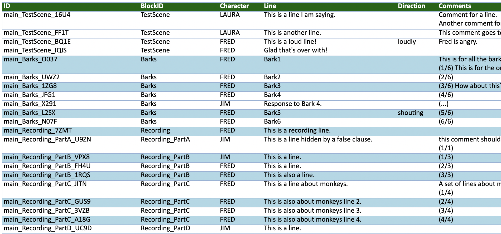
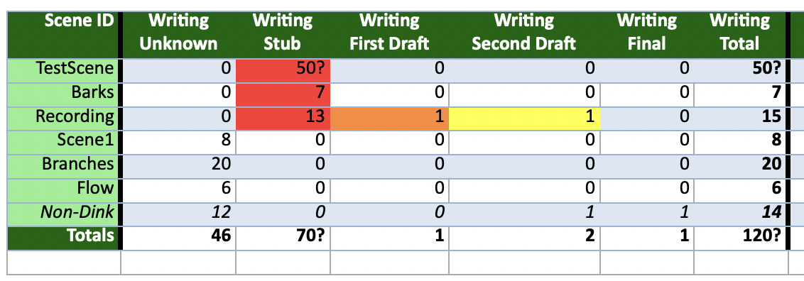
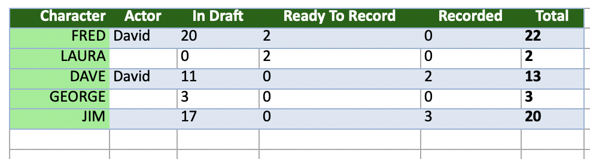
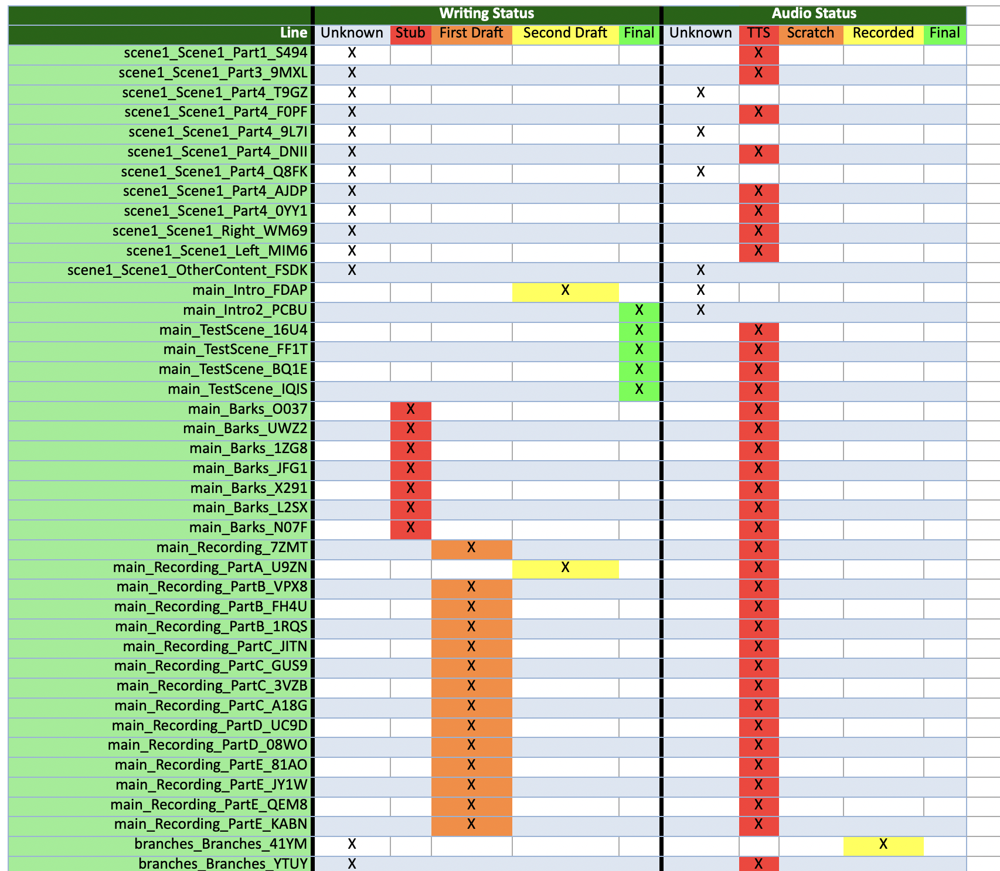
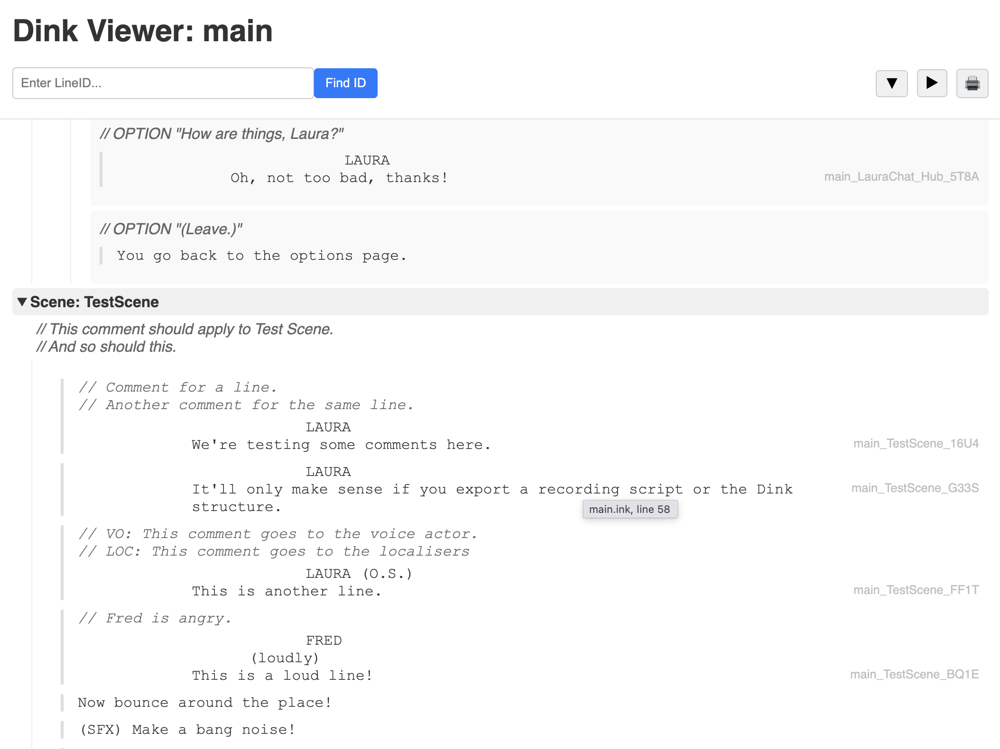

# dink

**Work in progress!**

**Dink**, a contraction of **dialogue ink**, is a way of formatting dialogue lines while using and writing in [Ink](https://www.inklestudios.com/ink/), and a set of tools for parsing and supporting that content. Importantly, it includes **production pipeline** features to make it easier to manage the content during development of a game.

## Ink + Dialogue

Inkle's [Ink](https://www.inklestudios.com/ink/) is a system of writing for text flow, piecing fragments of text together.

It was never designed for lines of dialogue, particularly spoken dialogue, so it's a bit of an odd idea to use it for a subset
of its real potential.

But that hasn't stopped a number of us using it that way anyway,
really appreciating the way Ink makes it easy to flow sections of story together depending
on the game state and choices that the player has made. It's great for conversations, and for sets of barks that depend on the current conditions.

So Dink presents some extensions for Ink; a simple markup for specifying dialogue lines and scene actions in an easy to write/read form.

More importantly, it provides tools to help integrate the extensions into a project and ease the production process. Because turning text into audio and managing all that is not trivial.

```text
=== MyScene
#dink
FRED (O.S.): It was a cold day in November...

Cut to a shot of a boat.

FRED (O.S.): (guilty) It wasn't me who sank the boat.
FRED (O.S.): It was Dave.

// ART: Remember Dave has a red hat.
Zoom in on Dave standing on deck.
DAVE: Thar she blows! 
-> DONE
```

### But why do I need it?

This all may seem very simple. Why wouldn't you just do some easy parsing in your runtime game - peel off the chunk "DAVE:" at the start so you know who is speaking?

At runtime, that's true.

But there's a lot to manage behind the scenes when dealing with dialogue:

* How many lines does Dave's actor have to record?
* Are the lines ready for record, or only first draft? Does a line need rewriting?
* Are some of Dave's lines already recorded?
* How do we distinguish each line, so we have a filename for recording?
* How do we identify a line to the localisation team?
* How do I make sure the writers didn't misspell a character name on some of the lines?
* What if the localisers mistype the markup?
* Can I pass comments to the localisation team and the voice actors? Where do I put those comments?
* How do I send my script to an editor or an IP holder to look over it and propose edits?
* Production really want to know how much there is left to do!

So with a simple bit of markup, Dink is targeted at helping out with the production pipeline.

## Summary

**Dialogue Lines**, **Action Lines**, **Localisation**, **Recording Scripts**, **Statistics**

Your Ink will work in your runtime as normal, but Dink adds extra info specifically
for lines of dialogue and helps you manage the production.

* **The `DinkCompiler`**:

  * Compiles your Ink as normal, but also extracts text lines for localisation, and parses out extra information such as who is saying which line and bundles it all up for your runtime.
  * Optionally exports recording scripts, localisation files, and lists of where lines came from.
  * Helps you manage the status of each individual line - is it first draft? Has it been recorded? And produces overview statistics - how many lines are still to be completed? How many lines still need to be recorded by a particular actor?
  * Can generate a placeholder audio file for each line for testing.
  * Can run in [live mode](#live-mode) which means it'll keep re-exporting your data every time you edit the Ink files.
* **Utilities**:
  * `DinkVoiceExport` - collects together source WAV files with certain criteria to make them easier for audio processing. For example, if you want to process all the recorded lines for a particular character, this collects them. Or all the lines marked `#vo:radio`.

### Contents

* [The Basics](#the-basics)
* [Source Code](#source-code)
* [Releases](#releases)
* [Usage](#usage)
  * [Overview](#overview)
  * [The Dink Spec](#the-dink-spec)
  * [Command-Line Tool](#command-line-tool)
  * [Character List](#character-list)
  * [Writing Status](#writing-status)
  * [Audio File Status](#audio-file-status)
  * [Comment and Tag Filtering](#comment-and-tag-filtering)
  * [Recording Script](#recording-script)
  * [Stats File](#stats-file)
  * [Google TTS](#google-tts)
  * [Live Mode](#live-mode)
  * [Config File](#config-file)
* [Utilites](#utilities)
  * [Dink Viewer](#dinkviewer)
  * [Dink Voice Export](#dinkvoiceexport)
* [Contributors](#contributors)
* [Acknowledgements](#acknowledgements)
* [License](#license)

## The Basics

The `DinkCompiler` will take in an Ink file (for example, `myproject.ink`) and its includes, process it, and the results are the following:

* **Updated Source File (`myproject.ink`)**:\
Any lines of text in the source Ink file that don't have a unique identifier tag of the form `#id:xxx` will have had those tags added.
* **Compiled Ink File (`myproject.json`)**:\
The Ink file compiled to JSON using `inklecate`, as Inky usually does.
* **Dink Runtime File (`myproject-dink.json`)**:\
A JSON structure containing one entry for each LineID, with the runtime data you'll need for each line that you won't get from Ink e.g. the character speaking etc.
* **Strings Runtime File (`myproject-strings-en-GB.json`)**:\
A JSON file containing an entry for every string in Ink, along with the string used in the original script. This is probably your master language file for runtime - you'll want to create copies of it for your localisation. When you display an Ink or Dink line you'll want to use the string data in here rather than in Ink itself. (You can change that default ISO code to `en-US` if you must!)
* **Dink Structure File (`myproject-dink-structure.json`)**:\
*(Optional)* A JSON structure containing all the Dink scenes and their blocks, snippets, and beats, and useful information such as tags, lines, comments and so on. This is most likely to be useful in your edit pipeline for updating items in your editor based on Dink scripts - for example, creating placeholder scene layouts.
* **Origins File (`myproject-origins.json`)**:\
*(Optional)* A JSON structure useful for debugging and editing, which lists the origin of
each line of text, giving filename, line number, knot, and stitch.
* **Stats File (`myproject-stats.xslx`)**:\
*(Optional)* An Excel file giving details of the status of every line in the game, both writing and recording.
* **Strings File for Localisation (`myproject-loc.xslx`)**:\
*(Optional)* An Excel file containing an entry for every string in Ink that needs localisation. When they are Dink lines, will include helpful data such as comments, the character speaking.
* **Recording Script File (`myproject-recording.xslx`)**:\
*(Optional)* An Excel file containing an entry for every line of dialogue that needs to be recorded, along with helpful comments and direction, and if you have provided a `characters.json` file, the Actor associated with the character.
* **Temp Audio Files** (`id_of_a_line_XXXX.wav`):\
*(Optional)* Dink can use Google TTS to generate a temp WAV file for each line; and to regenerate them if you change your text.

## Source Code

The source can be found on [Github](https://github.com/wildwinter/dink), and is available under the MIT license.

## Releases

Releases are available in the releases area in [Github](https://github.com/wildwinter/dink/releases).

## Usage

### Overview

Here's a quick how-you-might-use...

1. **Set up a [Project Config File](#config-file)** so you don't have to keep typing everything on the command line.
2. **Create a [Character List File](#character-list)** so you can check that the script you're writing doesn't have any mistakes in character names.
3. **Write your script in [Dink Format](#the-dink-spec)**, which is just **Ink** with some very simple rules on top. \
e.g.

```text
VAR DaveDrunk = true // Pure Ink
-> MyScene

== MyScene
#dink

DAVE: (angrily) Are you awake?
LAURA: (sleepily) Yes!
DAVE: Not sure I believe you. // VO: Dave could be convinced

Laura turns the light on.

LAURA: There, awake, okay?

{DaveDrunk: // This is pure Ink

    DAVE: Yeah. Ow my head. // VO: He's still drunk.
    -> HangoverScene

- else:

    DAVE: Yep. Let's go for a run!

    Laura looks freaked out by this.

    -> RunningScene

}

```

4. **Run the [Dink Compiler](#command-line-tool)** which will take your ink file and anything it includes, decorate it with `#id:` tags so each line has a unique identifier, compile it to JSON like Inky normally does, and then produce a whole pile of other useful things - runtime files you can use in your game, and lots of production files like a [recording script](#recording-script) for use in the booth, a [stats overview file](#stats-file), a localisation file and so on.
5. **Load the Ink JSON file** into your game.
6. **Load the extra Dink runtime JSON file** into your game.
7. **Load the Dink strings file** and any other copies you've made in other languages into your game.
8. **Step through Ink at Runtime** using standard Ink calls such as `story.Continue()`.
    * Each Ink line will have an `#id` tag.
    * You can use that ID to grab extra line data from the Dink runtime file (like who is speaking).
    * Instead of using the text that Ink gives you, instead you can use the ID to grab the string from whichever strings file you are using for localisation.
    * The ID should be the filename of the audio file to play, depending how you've set things up.

Don't forget to use all the useful extra Dink features such as stats, writing status, audio status and so on.

That's it, you have a working dialogue system!

### The Dink Spec

**Dink** is just **Ink**, but with some extra rules about lines of dialogue. Knots of Ink can mix freely with Knots of Dink.

To denote a stitch as containing Dink, you just tag it with `#dink` at the top, like so:

```text
== Knot1
This is a normal Ink knot.
-> DONE

== Knot2
#dink
DAVE: This is a Dink knot!
-> DONE
```

In a Dink knot, along with your normal Ink logic and flow, there are two types of lines - **dialogue** lines and **action** lines. Dink calls them *beats*.

A **dialogue** line looks like this:

```text
CHARACTER_NAME (optional qualifier): (optional direction) A line of dialogue
```

* The *optional qualifier* is the sort of thing you find on a movie script which might say (O.S.) for off-screen or (V.O.) for voice-over.
* The *optional direction* is the sort of thing you find in a movie script which might say (disappointed) or (sarcastic).

An **action** line is a normal line of text!

e.g.

```text
== MyScene
#dink
// This beat is a dialogue line
DAVE (V.O.): It was a quiet morning in May... #id:intro_R6Sg

// This beat is another dialogue line.
DAVE: Morning. #id:intro_XC5r

// An action beat
Fred walks into the room.

// This is more dialogue
FRED: (excitedly) Hello to you too! #id:intro_uy78

// An action beat
(SFX) The door slams. #id:intro_yS6G
-> DONE
```

At a very simplistic level, each beat can be interpreted as "X happens, then X happens", just like a movie script.

You can mix in Ink logic and options as usual. You can't use glue such as `<>` as recorded dialogue isn't the sort of thing you want to stitch together.

Just keep your scripts clean and straightforward and all should work fine!

#### Comments

Comments will be read from your script by Dink and copied
into recording scripts and localisation documents.

Comments use `//` to make them meaningful to Dink, but any content in block-style comments
(e.g. `/* */`) will be skipped, like in normal Ink.

Comments *above* a block (i.e. above the knot or the stitch) will appear in the comments for that block.

Comments above a beat will appear in the comments for that beat, and so will comments on the end of a beat.

```text
// This comment will appear in the comments for MyScene's main block
// And so will this comment.
== MyScene
#dink
// This comment will appear in the comments for this next beat
DAVE (V.O.): It was a quiet morning in May... #id:intro_R6Sg // And so will this comment.
-> DONE
```

See also [Comment and Tag Filtering](#comment-and-tag-filtering) to find out how you can control which comment gets output where!

#### Choice Options

Dink automatically adds comments the recording script saying when a line follows an option in the script. `OPTION: I'm not sure.` This makes life easier for voice direction.

All the examples here are valid.

Paraphrase text followed by option:

```text
== MyScene
#dink
ROB: So what are you thinking?

* [I'm not sure.]
    FRED: I'm really not sure. 
    ROB: Oh, make up your mind.

* [The blue one?]
    FRED: I think the blue one - what do you think?
    ROB: Hey, it's your spacecat.

* [The green one.]
    FRED: The green one.
    ROB: Really? Green is so last year.
-
ROB: Anyway, shall we go to the pub?
-> DONE
```

Similarly it works fine with diverts:

```text
== MyScene
#dink
ROB: So what are you thinking?

* [I'm not sure.]
    -> NotSure

* [The blue one?]
    -> BlueCat

* [The green one.]
    -> GreenCat
```

And it works with spoken Dink lines if you don't
want paraphrases:

```text
== MyScene
#dink
ROB: So what are you thinking?

* [FRED: I'm really not sure.]  
    ROB: Oh, make up your mind.

* [FRED: I think the blue one - what do you think?]
    ROB: Hey, it's your spacecat.

* [FRED: The green one.]
    ROB: Really? Green is so last year.
-
ROB: Anyway, shall we go to the pub?
-> DONE
```

or without square brackets, depending on how your story
parsing is presenting options at runtime.

```text
== MyScene
#dink
ROB: So what are you thinking?

* FRED: I'm really not sure.
    ROB: Oh, make up your mind.

* FRED: I think the blue one - what do you think?
    ROB: Hey, it's your spacecat.

* FRED: The green one.
    ROB: Really? Green is so last year.
-
ROB: Anyway, shall we go to the pub?
-> DONE
```

#### Shuffles and Cycles

Dink is happy with structures like:

```text
== DangerBark
#dink
{shuffle:
- FRED: Look out, danger!
- FRED: Aagh, peril!
- FRED: Ooh, uncertainty!
}
```

And will mark recording scripts with a count e.g. `(1/3)` to show that a line is one of a set of alternative lines. Again this makes life easier for voice direction.

It can even cope with:

```text
== FancyBark
#dink
// This gets numbered 1/6 - 6/6 for the recording script.
{stopping:
- FRED: Fancy Bark 1 
- FRED: Fancy Bark 2 
- FRED: Fancy Bark 3 
- FRED: Fancy Bark 4 
-   {shuffle:
        - FRED: Spinning on fancy bark 5 
        - FRED: Spinning on fancy bark 6
    }
}
-> DONE
```

#### Switches and Tests

Dink can handle switches and tests, but just lay them out so that **conditions are
on different lines from the Dink**. So these are all fine:

```text
VAR testInt = 0
VAR testString = ""

== LineTest
#dink
{
- testInt==1:
    FRED: This should be fine.
- testInt==2:
    GEORGE: So should this.
}
-> DONE

== StringExpressionsTest
#dink
{testString:
- "test1":
    GEORGE: Huh.
- "test2":
    FRED: Huh yourself.
}
-> DONE
```

But these are **NOT** and Dink will complain on parsing:

```text
VAR testInt = 0
VAR testString = ""

== LineTest
#dink
{
- testInt==1: FRED: This should be fine.
- testInt==2: GEORGE: So should this.
}
-> DONE

== StringExpressionsTest
#dink
{testString:
- "test1": GEORGE: Huh.
- "test2": FRED: Huh yourself.
}
-> DONE
```

Just lay things out cleanly and it should be fine!

#### Internally

A Dink **scene** is the equivalent of an Ink **knot**.

Each Dink scene consists of one or more Dink **blocks**. A Dink block is the equivalent of an ink **stitch**.

A scene might only contain one block, the "main" block, which is unnamed. Any further blocks will be named after the stitch.

Each Dink block consists of one or more Dink **snippets**. A Dink snippet is the equivalent of an Ink flow fragment - it is a run of lines that doesn't have any flow changes or diversions in it.

Each **snippet** consists of **beats**.

Each beat can either be a **line of dialogue**, or a **line of action**.

Here is a scene with an anonymous block to start and then another:

```text
== MyOtherScene
#dink
// This is the anon block
FRED (V.O.): It was a cold day in December... #id:main_MyOtherScene_R6Sg
-> Part2

// This is the block called Part2
= Part2
// This is fred talking.
FRED: Good morning! #id:main_MyOtherScene_Part2_R6Sg
-> DONE
```

### Command-Line Tool

This is a command-line utility with a few arguments. A few simple examples:

Use the file `main.ink` (and any included ink files) as the source, and output the resulting files in the `somewhere` folder:

```./DinkCompiler --source ../../tests/test1/main.ink --destFolder ../somewhere```

Or instead, grab all the settings from a project file:
`./DinkCompiler --project dink.jsonc`

#### Arguments

* `--source <sourceInkFile>` (REQUIRED)

    Entrypoint to use for the Ink processing.\
    e.g. `--source some/folder/with/main.ink`

* `--destFolder <folder>`

    Folder to put all the output files.\
    e.g. `--destFolder gameInkFiles/`\
    Default is the current working dir.

* `--project project/config.jsonc`

    If supplied, configuration will be read from the given JSON file, instead
    of just given as command-line options. This also means that the folder that the
    supplied project file is in will be treated as a potential source file for the Ink
    and for the characters.json if those aren't fully qualified paths.
    See [Config File](#config-file) for details. You can do more with it than
    you do with the command-line options.

* `--live`

   [Live Mode](#live-mode) - Starts the compiler on a loop - when you edit Ink files, the compiler will automatically
   run to regenerate the output files based on your changes.\
   Type q then ENTER on the command line to stop it.

* `--locActions`

    If present, includes the text of action beats as something that
    needs to be localised by including it in `-strings` and `-loc` files.\
    If false, skips that text, but does include it in `-dink`.\
    Default is false.

* `--dinkStructure`

    If present, outputs the structured Dink JSON file (`*-dink-structure.json`).

* `--localization`

    If present, outputs the strings in an Excel file for localisation (`*-loc.xlsx`).

* `--recordingScript`

    If present, outputs the recording script Excel file (`*-recording.xlsx`).

* `--stats`

    If present, outputs a file of the status of all the lines as an Excel file (`*-stats.xlsx`).

* `--origins`

    If present, outputs a JSON file giving the file, line number, knot, and stitch where you'll find your text. Useful for editor and debug tools. (`*-origins.json`).

* `--ignoreWritingStatus`

    If present, ignores the writing status when deciding what to include in the recording script
    or localisation script. Useful for a full dump of lines.

* `--tts`

    Use Google TTS to generate temp audio for your spoken lines.
    You need to [configure it](#google-tts) first in the config file.

* `--nostrip`

    By default, any Ink lines which have been given and ID and exported as a string in the string table (for localisation) will be stripped from the compiled Ink JSON file. Instead,
    you'll get back an ID e.g. `someFilename_someKnot_someStitch_XXZZ`. Passing this param
    will leave the strings during compilation.

### Live Mode

If you call the compiler on the command line with `--live` it will start waiting for changes to your Ink files. Any changes will cause the compiler to rebuild and reexport everything (according to the [project config](#config-file)). This means your scripts and stats will always be up to date!

Once you're done, type q then ENTER on the command-line and the compiler will stop.

### Character List

You can optionally supply a `characters.json` file in the same folder as the main Ink file. If, so it should be this format:

```jsonc
[
    {
        "ID":"FRED", 
        "Actor":"Dave"
    },
    {
        "ID":"JIM"
    },
]
```

When the Dink scripts are parsed, the character name on a Dink line like:

```text
FRED (O.S): (hurriedly) Look out!
```

will be checked against that character list, and if it isn't present the process will fail.

The **Actors** column will be copied in to the recording script export, for ease of use with recording.

#### Cast Recording Stats

If you supply a Characters list list this you will also get a Cast page in the Excel [stats file](#stats-file).
This will list all the characters, how many lines exist for them, how many are ready to record and how many are already recorded.

### Writing Status

*You don't need to use this, but it might be handy!*

This tool lets you mark each line of text, whether Dink or not, with a tag that
gives its writing status. And then lets you export an Excel file showing the status
of all the lines in the project.

You can define a list of statuses in your project file, to suit whatever your project needs.
Each status type has:

* A tag which you'll put in your Ink file.
* A status label which will end up in the status Excel document.
* An optional colour which will end up in the status Excel documen (to easily see those unfinished lines!)
* Flags to say whether a line of this status should be included in recording or in localisation.

If you don't specify any statuses in the project file, the system won't be used, and all your lines will be included in recording and localisation.

#### The Status Tag

In Ink, you'll use a tag starting with `#ws:` - for example, `#ws:final`, `#ws:draft1` etc.

You can define these.

#### Defining Statuses

This list of statuses can be customised in the [Project Config File](#config-file).

Here's an example set of statuses. These enable you to use
`#ws:stub`, `#ws:draft1`, `#ws:draft2`, `#ws:final`:

```jsonc
"writingStatus": [
    {
        // Label to put in the Excel file
        "status": "Final", 
        // Tag to use e.g. #ws:final
        "wstag": "final", 
        // If true, export lines of this status to the recording script
        "record": true, 
        // If true, export lines of this status to the localisation script
        "loc": true, 
        // A color to make the Excel file pretty!
        "color": "33FF33" 
    },
    {
        "status": "Second Draft",
        "wstag": "draft2",
        "color": "FFFF33"
    },
    {
        "status": "First Draft",
        "wstag": "draft1",
        "color": "FF8833"
    },
    {
        "status": "Stub",
        "wstag": "stub",
        "color": "FF3333"
    }
]
```

#### Applying Tags

You can put a tag on a line, as you might expect:

```text
FRED: Hello folks! #id:main_Script1_HG5x #ws:draft1
```

But it would be really annoying to have to do that on every line. So you can also apply a status at the top of a stitch, then it'll apply to every line in that stitch (unless you override it on an individual line). Similarly you can apply it to the knot containing the stitch or to the file itself!

```text
//Myfile.ink
#ws:stub

== Scene1
#dink
FRED: This line will appear as a stub because it inherits from the top of the file.
-> Scene2

== Scene2
#dink
#ws:draft1
FRED: This line will appear as draft 1.
FRED: And so will this.
JIM: But this will appear as draft2. #ws:draft2
-> Stitch1

= Stitch1
#ws:final
JIM: Everything here will be final.
JIM: Apart from this. #ws:draft
JIM: But this will will be final.
-> Stitch2

= Stitch2
GEORGE: I'm still Draft1 because that's what my Knot says.
-> DONE

== Scene3
#dink
FRED: But I am back to being a stub!
JIM: Unlike me! #ws:final
```

### Audio File Status

*You don't need to use this, but it might be handy!*

This tool assumes that you want to store your audio dialogue files in folders somewhere in your game. And that you put them into different folders depending on the status of the audio line.

It assumes that you name your audio file after the LineID of the line.

So, if you have this line:

```text
DAVE: Morning. #id:intro_XC5r
```

Then you probably have a file named `intro_XC5r.wav` or something similar. Any file extension is fine, so long as the filename starts with the line ID. So `intro_XC5r_v1.mp3` is also fine.

By default, the recording export routine will look for something matching that file in the following order:

* `./Audio/Final`
* `./Audio/Recorded`
* `./Audio/Scratch`
* `./Audio/TTS`

And the first one it finds, it will set as the `AudioStatus` of the file in the output `-recording.xlsx` Excel voice recording file. Or `Unknown` if it can't find it at all.

(All these folders are searched for under your project folder if you have one, or your main Ink file folder otherwise.)

This list of folders and statuses can be customised in the [Project Config File](#config-file), like so:

```jsonc
    // This is the default where the game will look for
    // audio files that start with the ID names of the lines.
    // The folders (and their children) will be searched in this
    // order, so if a line is found in (say) the Audio/Recorded folder first, 
    // its status in the recording script will be set to Recorded.
    // If not found, the status will be set to Unknown.
    // Folders will be relative to the project file.
    "audioStatus":[
        {
            // Label to put in the Excel file
            "status": "Final",
            // If a file is in this folder, it gets treated as Final
            "folder": "Audio/Final",
            // A color to make the Excel file pretty!
            "color": "33FF33",
            // Means this status counts as recorded for figuring out actor requirements.
            "recorded": true
        },
        {
            "status": "Recorded",
            "folder": "Audio/Recorded",
            "color": "FFFF33",
            // Means this status counts as recorded for figuring out actor requirements.
            "recorded": true
        },
        {
            "status": "Scratch",
            "folder": "Audio/Scratch",
            "color": "FF8833"
        },
        {
            "status": "TTS",
            "folder": "Audio/TTS",
            "color": "FF3333"
        }
    ]
```

### Comment and Tag Filtering

*You don't need to use this, but it might be handy!*

When creating the voice recording script and the localisation document, by default Dink
includes all comments (and all tags for the recording script). But you can tweak that in settings so that only specific comments and tags get
into those particular scripts.

e.g. if your script has something like:

```text
// This is the line about the blue mushroom.
// SFX: Make sure there's a blue mushroom sound here.
// VO: Remember this is at a distance from the enemy.
// LOC: This is a toadstool, genus todus stoolus.
FRED: It's big, and it's blue!
```

That's an awful lot of comments to end up everywhere.
You can set up your comment filter to use whatever prefixes suit your project.
The '?' option means "If a line has no prefix, include it."
By default, everything is included.

```jsonc
// Control which comments are seen on which script
// By default everything is passed.
"commentFilters": {
    // For localisation, include comments with no prefix, but also prefix LOC: and VO:
    "loc": ["?","LOC", "VO"],
    // For recording script, includes comments with no prefix, but also prefix VO:
    "record": ["?","VO"]
}
```

Similarly, if your script includes tags for the VO processing team:

```text
FRED: It's big, and it's blue! #vo:loud #vo:radio
```

Then this would make sure those tags are passed through. By default, NO tags are
passed to the recording script (or you'd be overwhelmed!)

```jsonc
// Control which tags are seen on which script
// By default nothing is passed.
"tagFilters": {
    // Currently only the recording script exports tags. Same rules as comment filters!
    // This passes tags such as #vo:loud or #vo:soft
    "record": ["vo"]
}
```

Comment and tag filters can be customised in the [Project Config File](#config-file).

### Recording Script


*A section of the spreadsheet. It's quite wide.*

This lists all the recordable voice lines in the game. (If you've set up your [Writing Statuses](#writing-status) only lines that count as `record` will be included.)

There are a whole bunch of different columns here which may
or may not be useful to your recording setup, but amongst other things it shows:

* **Line ID** - This will stay the same throughout the project. You can see it at the end of each Ink line.
* **Block ID** - Knot in the Ink script that contains the line.
* **Character** - e.g. `FRED: Hello!` will have `FRED` in this line.
* **Actor** - From the [Character List](#character-list)
 file.
* **Text** - The actual text to record!
* **Direction** e.g. `MARK: (angrily) Hello!`
* **Comments**, which can be inherited from the Knot or the Stitch or the line itself, and also include autogenerated things to be helpful in the booth like:
  * Information about groups of alternative lines like `(1/3)`,`(2/3)` if the line is part of an Ink shuffle or cycle or a set of alternatives with tests.
  * Information on whether the line follows an Ink option in a choice, and what the text of that option is.
  * `MERGE` if the line is a gather after a set of alternatives.
* **Tags** from Ink which are useful to call out specific classes of line that are useful for whoever is processing the audio. e.g. `#vo:loud` or `#vo:radio`
* **Snippet ID** - Lines which have the same snippet ID are a *run* of lines that don't have any branching or alternatives in it. That's useful for the actor and director to know. It's also highlighted by the file colouring.
* **Audio Status** - Which tracks the [Audio Status](#audio-file-status) so that you know if a line still needs to be recorded or not!

### Stats File

The **Stats File** is output as Excel format, and gives you a bunch of hopefully useful information about the project!

For this to work, make sure you've set up your [Writing Status](#writing-status) and [Audio Status](#audio-file-status) in the [Project Config File](#config-file).

#### Status Summary


An overview of the state of each scene.

Note that it has one entry called *Non-Dink*, which includes
any written text in Ink that isn't part of a #dink knot. It's included so you can still track status and localisation of that text.

##### Estimates

If you set up estimates in the project file, like so:

```jsonc
    // Estimates
    "estimates":[
        {"tag":"conversation", "lines":50},
        {"tag":"barks", "lines":20},   
        {"tag":"ambients", "lines":2},   
        {"tag":"cutscene", "lines":10}        
    ]
```

And set any of the Writing Status settings to `estimate:true`:

```jsonc
    [
        {
            "status": "First Draft",
            "wstag": "draft1",
            "color": "FF8833"
        },
        {
            "status": "Stub",
            "wstag": "stub",
            "color": "FF3333",
            "estimate": true
        }
    ],
```

Then any scene with a relevant tag that only has lines of that status or less will use the estimate from the estimates list in the stats table.

This is a way of rapidly guessing the size of the game. You
might sketch out all the conversations and cutscenes as
`#ws:stub` status (giving them tags of `#conversation` or `#cutscene`) and Dink's stats will use the estimates rather than the real stub line count.

So if your stub has 1 placeholder line, but you expect it to become a conversation of 50 lines, this is how you track that.

Estimates will have a `?` in the relevant column e.g. `50?`



#### Cast Summary



If you've set up your [Character List](#character-list), then this page will show you an overview of your characters, the actors connected to them, and the states of any lines that are for them.

#### Line Statuses



This gives you the state of every single line in the game,
and follows the recordable Dink lines with the non-Dink Ink text lines (which won't have any Audio Status).

This is less useful for reading and more useful to do filtering and sorting in Excel so you can look at what's
still to do.

### Google TTS

*This is NOT for production. The production quality is awful. This is to create crappy simple audio files for testing out your playback systems.*

You can get the compiler to use Google's Text to Speech system to create terrible placeholder WAV
files for your production.

*You will need a Google Text to Speech API account and a JSON authentication file.*

To do that, provide Google TTS config settings in the project file.

```jsonc
    // GoogleTTS parameters
    "googleTTS": {
        "generate":true, // If false, you'll need to use --tts on the command-line
        "authentication":"google-tts-key.json",
        "outputFolder":"Audio/TTS"
    }
```

If you make sure your `outputFolder` matches a folder in your [Audio Status](#audio-file-status) config then the generated TTS will appear in your audio status results.

To specify the voice to use for each character, specify the Google Voice ID in the [Character List](#character-list) like so:

```jsonc
[
    {
        "ID":"FRED", 
        "Actor":"David",
        "TTSVoice":"en-GB-Standard-B"
    },
    {
        "ID":"LAURA",
        "TTSVoice":"en-GB-Standard-A"
    }
]
```

### Config File

A JSON or JSONC file (i.e. JSON with comments) having all or some of the required options:

```jsonc
{
    // What's the source Ink file?
   "source":"main.ink",

    // Where's the folder to output everything?
    "destFolder":"../examples",

    // What code should be used for the strings file name?
    "defaultLocaleCode":"en-GB",
    
    // Localise actions?
    // Default is false, which means no text in Action beats
    // will be localised
    "locActions":false,

    // Don't strip the text from the compiled Ink
    "nostrip":true,
    
    // If true, outputs the structured dink file (json)
    "outputDinkStructure": false,
    
    // If true, outputs the loc file (xlsx)
    "outputLocalization": false,
    
    // If true, outputs the recording script file (xlsx)
    "outputRecordingScript": false,

    // Sometimes you want to output every single line in a recording or loc script
    // to see what you've got.
    "ignoreWritingStatus": false,

    // If true, outputs the stats file (xlsx)
    "outputStats": true,

    // This is where the game will look for
    // audio files that start with the ID names of the lines.
    // The folders (and their children) will be searched in this
    // order, so if a line is found in (say) the Audio/Recorded folder first, 
    // its status in the recording script will be set to Recorded.
    // If not found, the status will be set to Unknown.
    "audioStatus":[
        {
            "status": "Final",
            "folder": "Audio/Final",
            "color": "33FF33",
            // Means this status counts as recorded for figuring out actor requirements.
            "recorded": true
        },
        {
            "status": "Recorded",
            "folder": "Audio/Recorded",
            "color": "FFFF33",
            // Means this status counts as recorded for figuring out actor requirements.
            "recorded": true
        },
        {
            "status": "Scratch",
            "folder": "Audio/Scratch",
            "color": "FF8833"
        },
        {
            "status": "TTS",
            "folder": "Audio/TTS",
            "color": "FF3333"
        }
    ]

    // Writing status tags - OPTIONAL - can be written on an Ink line as #ws:someStatus
    // e.g. #ws:final or #ws:draft1
    // If defined here, the following rules kick in:
    // - If a file has a tag, everything in it defaults to that tag.
    // - If a knot has a writing tag that overrides the file tag.
    // - If a stitch has a writing tag that overrides the knot or file tag.
    // - If a line has a writing tag that overrides the stitch, knot or file tag.
    // - Only statuses with a record value of true will get sent to the recording script.
    // - Only statuses with a loc value of true will get sent to the localisation strings.
    // - The stats file will show all statuses.
    // If this section is not defined, no writing status tags are used and everything will be
    // sent to recording script and localisation.
    // If a line has no status it will be treated as "Unknown".
    // The color is what ends up in the Excel file for a line of this status - it's optional.
    "writingStatus": [
        {
            "status": "Final",
            "wstag": "final",
            "record": true,
            "loc": true,
            "color": "33FF33"
        },
        {
            "status": "Second Draft",
            "wstag": "draft2",
            "color": "FFFF33"
        },
        {
            "status": "First Draft",
            "wstag": "draft1",
            "color": "FF8833"
        },
        {
            "status": "Stub",
            "wstag": "stub",
            "color": "FF3333",
            "estimate": true
        }
    ],

    // Control which comments are seen on which script
    "commentFilters": {
        // For localisation, include comments with no prefix, but also prefix LOC:
        "loc": ["?","LOC"],
        // For recording script, includes comments with no prefix, but also prefix VO:
        "record": ["?","VO"]
    },

    // Control which tags are seen on which script
    // By default nothing is passed.
    "tagFilters": {
        // Currently only the recording script exports tags. Same rules as comment filters!
        // This passes tags such as #vo:loud or #vo:soft
        "record": ["vo"]
    },

    // GoogleTTS parameters
    "googleTTS": {
        "generate":true, // If false, you'll need to use --tts on the command-line
        "authentication":"google-tts-key.json",
        "outputFolder":"Audio/TTS"
    },

    // Estimates
    "estimates":[
        {"tag":"type:conversation", "lines":50},
        {"tag":"type:barks", "lines":20},   
        {"tag":"type:ambients", "lines":2},   
        {"tag":"type:cutscene", "lines":10}        
    ]
}
```

## Utilities

### DinkViewer



This tool can output the Dink structure as several formats that are more readable than Ink for non-programmers - a bundled HTML page allowing interactive searching and folding, as a PDF document, or as a Word document.

The documentation is [here - DinkViewer](csharp/DinkViewer/README.md).

### DinkVoiceExport

This was created to help out the audio team. You give it a spec of particular Dink lines, and it collects the corresponding WAV files and copies them to a destination.

The documentation is [here - DinkVoiceExport](csharp/DinkVoiceExport/README.md).

## Contributors

* [wildwinter](https://github.com/wildwinter) - original author

## Acknowledgements

As ever, huge thanks to [Inkle](https://www.inklestudios.com/) (and **Joseph Humfrey** in particular) for [Ink](https://www.inklestudios.com/ink/) and the ecosystem around it, it's made my life way easier.

## License

```text
MIT License

Copyright (c) 2025 Ian Thomas

Permission is hereby granted, free of charge, to any person obtaining a copy
of this software and associated documentation files (the "Software"), to deal
in the Software without restriction, including without limitation the rights
to use, copy, modify, merge, publish, distribute, sublicense, and/or sell
copies of the Software, and to permit persons to whom the Software is
furnished to do so, subject to the following conditions:

The above copyright notice and this permission notice shall be included in all
copies or substantial portions of the Software.

THE SOFTWARE IS PROVIDED "AS IS", WITHOUT WARRANTY OF ANY KIND, EXPRESS OR
IMPLIED, INCLUDING BUT NOT LIMITED TO THE WARRANTIES OF MERCHANTABILITY,
FITNESS FOR A PARTICULAR PURPOSE AND NONINFRINGEMENT. IN NO EVENT SHALL THE
AUTHORS OR COPYRIGHT HOLDERS BE LIABLE FOR ANY CLAIM, DAMAGES OR OTHER
LIABILITY, WHETHER IN AN ACTION OF CONTRACT, TORT OR OTHERWISE, ARISING FROM,
OUT OF OR IN CONNECTION WITH THE SOFTWARE OR THE USE OR OTHER DEALINGS IN THE
SOFTWARE.
```
